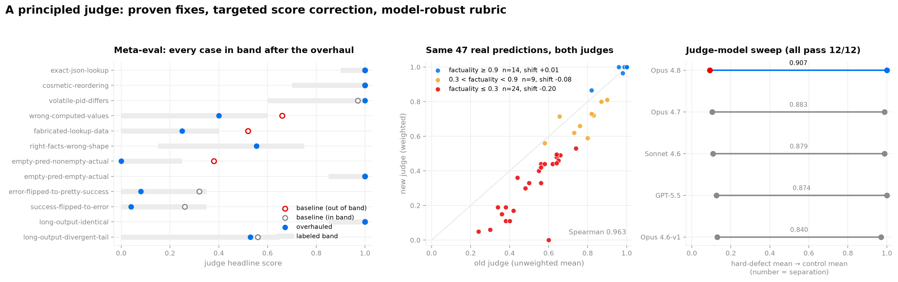

# A principled judge: proven fixes, targeted score correction, model-robust rubric

**Result.** The harness now has exactly one judge — `RubricJudge`, a 5-dimension rubric with a
factuality-weighted headline — and a *judge-quality meta-eval* that makes every judge change
provable. The overhaul took the meta-eval from 8/11 to 12/12 (stable across two runs, ±0.09),
and on 47 identical real predictions the score change is a targeted correction, not noise:
steps the judge rates factually right are unmoved (shift **+0.01**), steps rated factually
wrong drop (**−0.20**), and rankings are preserved (Spearman **0.963**). A five-model sweep
shows the rubric is model-robust (every candidate passes 12/12) and that **Opus 4.8 is the
best-calibrated judge** (separation 0.907).



## Why the judge needed an overhaul

The judge is the load-bearing metric of the harness: it is GEPA's fitness signal during
`wmh build` and the fidelity scorer behind every `wmh eval` number. It had accumulated two
structural problems:

1. **Two judges, one metric.** A single-score `LLMJudge` ("match") and the 5-dimension
   `RubricJudge` coexisted behind a `--judge` knob, while builds always optimized against the
   rubric — so an eval could silently score with a different metric than the one GEPA
   hill-climbed. The knob is gone; `RubricJudge` is the judge.
2. **Nothing pinned the judge's behavior.** A judge prompt edit could regress scoring with no
   test to catch it.

## The judge-quality meta-eval

`wmh/optimize/judge_quality.py` holds 12 hand-labeled cases — (action, actual observation,
predicted observation) triples with the headline band a sound judge must land in, plus optional
per-dimension bands. Content is modeled on real steps from the bundled corpora (tau-bench tool
JSON, terminal-task bash output). Five cases are *controls* (correct behavior to preserve:
exact matches, cosmetic reordering, volatile values, wrong computed values, fabricated data);
the rest reproduce suspected defects. A case whose verdict is judge-invalid fails regardless of
its score — a judge crash must not vacuously pass a low band.

Baseline on the pre-overhaul judge (Opus 4.8, Bedrock): **8/11**, and all three failures shared
one signature — **factuality ≤ 0.1 with a headline ≥ 0.38** (wrong-facts predictions scored
0.52–0.66) because format/realism are high for *any* well-shaped emission and the unweighted
mean let them mask factual failure. Notably, the judge's per-dimension scores were correct in
every failure; the defect was aggregation.

## The four fixes (each proven by a failing case or test first)

1. **Weighted headline.** `score = 0.5·factuality + 0.2·quality + 0.1·(format, consistency,
   realism)`. Factuality dominates because it *is* the definition of functional equivalence;
   the form dimensions remain as diagnostics. Any reply with all dimensions equal scores
   identically under both aggregations, so uniformly-judged steps keep their old scores. A
   `right-facts-wrong-shape` control (prose carrying correct facts → 0.56) guards against the
   headline collapsing into factuality alone.
2. **The prompt documents its own input.** The payload's `empty_sentinel` / `content_length`
   fields were never explained to the rubric judge (that guidance existed only in the deleted
   LLMJudge prompt). The prompt now describes every field and pins the edge rules: an empty
   prediction of a non-empty observation scores ~0 (baseline gave it 0.38 with format = 1.0);
   both-empty is an exact match; a flipped `is_error`/outcome is a factuality failure.
3. **Observations are middle-truncated at 6000+6000 chars.** Real corpora reach ~190 KB per
   observation (terminal-tasks, p99 32 KB). Head+tail (never head-only) because the
   `long-output-divergent-tail` case proves a divergence hidden in the tail must stay visible;
   `content_length` always reports the full length.
4. **Judge failures are not world-model failures.** A reply missing a dimension, out of range
   (0–100 scale confusion), or unparseable used to become score 0.0 — indistinguishable from
   "the prediction is garbage". Now it is retried once *with feedback* (observed on Bedrock: a
   temperature-0 re-ask reproduces the same malformed reply verbatim; the corrective re-ask
   recovers it), then flagged `JudgeResult.valid=False`. Replay and eval exclude invalid steps
   from fidelity and report them (`n_invalid` / `total_invalid`); GEPA imputes the batch's mean
   valid score (it needs one score per example) and drops judge-noise critiques from
   reflection.

After the fixes: **12/12**, all verdicts valid, controls unmoved — and a second run reproduces
it within ±0.09 on every case.

**rubric-v2 addendum (2026-07-08).** Reconciling with main surfaced a truncation blind spot:
two equal-length observations diverging only in the omitted middle were byte-identical to the
judge (a hidden-middle fabrication scored ~1.0). Truncated payloads now carry `content_sha256`
and the prompt caps factuality ≤ 0.5 / quality ≤ 0.4 when hashes differ while visible text
matches; a 13th case (`long-output-divergent-middle`) pins it — 13/13 live on Opus 4.8 with
all controls unmoved (equal hashes still verify to 1.0). Judge exceptions (throttle/5xx) now
route through `valid=False` in GEPA instead of scoring 0.0, and `JUDGE_VERSION = "rubric-v2"`
is persisted in eval results so cross-version rows are never silently compared.

## Fidelity numbers: a targeted correction, not a regression

The weighted headline changes what `overall_fidelity` means, so the shift was measured by
scoring **the same 47 real predictions** (seeded sample across all three corpora; zero-shot
Opus 4.7 world model; predictions generated once and cached) with both judges on Opus 4.8:

| slice (by new-judge factuality) | n | mean shift (new − old) |
|---|---|---|
| ≥ 0.9 | 14 | **+0.01** — well-predicted steps unmoved |
| 0.3 – 0.9 | 9 | −0.08 |
| ≤ 0.3 | 24 | **−0.20** — the masking defect being removed |
| overall | 47 | 0.701 → 0.584, Spearman **0.963**, 0 invalid |

Every one of the 8 largest per-step drops has factuality ≤ 0.4, and reading the texts confirms
each deserved it (flipped timeouts, `pip: not found` scored as a successful install, fabricated
tau-bench order items). **Absolute fidelity is not comparable across the overhaul**: pre-#83
numbers (e.g. the trace-scaling figure) were produced by the old judge at their commits and
remain reproducible there; new runs are ~0.10–0.12 lower on the same predictions, entirely on
low-factuality steps.

## Which model should judge?

The meta-eval doubles as a judge-model benchmark. Five candidates, each pinned (no failover):

| judge model | pass | high-band controls (→1.0) | hard-defect mean (→0.0) | separation |
|---|---|---|---|---|
| **Opus 4.8** | 12/12 ×2 | **1.000** | **0.093–0.095** | **0.907** |
| Opus 4.7 | 12/12 | 0.988 | 0.105 | 0.883 |
| Sonnet 4.6 | 12/12 | 0.988 | 0.109 | 0.879 |
| GPT-5.5 | 12/12 | 1.000 | 0.126 | 0.874 |
| Opus 4.6-v1 | 12/12 | 0.970 | 0.130 | 0.840 |

**Opus 4.8 stays the pinned judge** — best on every axis and stable across runs. Sonnet 4.6 is
the budget alternative (switching judge models means re-baselining). That *all five* pass
outright is itself a result: the overhauled prompt and weighting are properties of the rubric,
not artifacts of tuning to one model. The judge stays pinned to one model per run — it never
rides the provider failover chain (shipped separately with the failover work, which documents
the contract in `docs/reference/failover.md`).

## Reproduction

```bash
# The meta-eval, against any pinned judge model (12 labeled cases; ~1 min):
uv run python - <<'EOF'
from wmh.optimize.judge import RubricJudge
from wmh.optimize.judge_quality import run_judge_quality
from wmh.providers import ProviderConfig, ProviderKind, get_provider

judge = RubricJudge(get_provider(ProviderConfig(
    kind=ProviderKind.BEDROCK, model="us.anthropic.claude-opus-4-8")))
report = run_judge_quality(judge, concurrency=4)
for v in report.verdicts:
    print("PASS" if v.passed else "FAIL", v.case_id, f"{v.score:.3f}", v.failures)
print(report.summary())
EOF

# Fidelity with the overhauled judge (any corpus):
uv run wmh eval examples/tau-bench/traces.otel.jsonl --no-rag --sample-turns sampled
```

The deterministic behavior (weighting, truncation, retry/validity, invalid exclusion) is pinned
by `wmh/optimize/judge_test.py`, `judge_quality_test.py`, `wmh/engine/replay_test.py`,
`eval_test.py`, and `wmh/optimize/gepa_test.py`.
