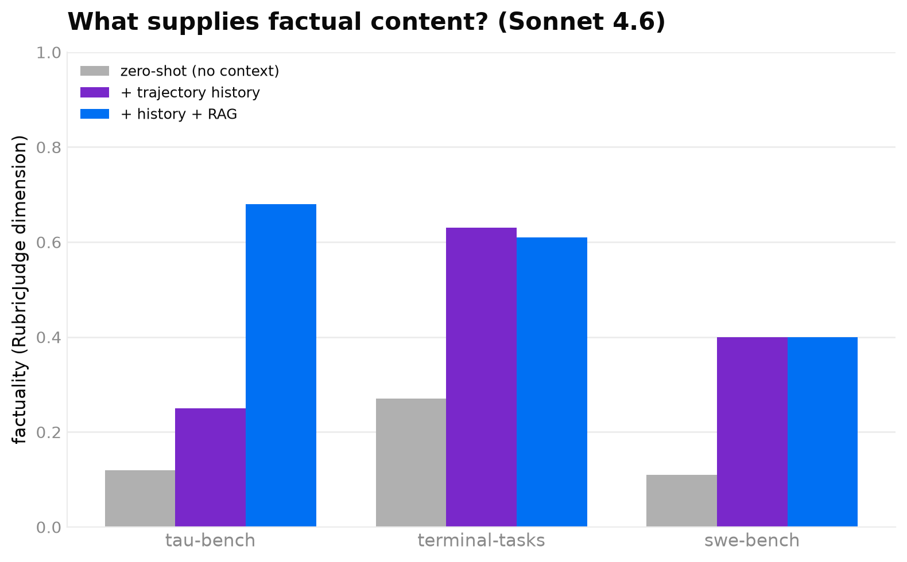

# Evaluation signal & contamination — is the metric measuring world-modeling?

> **Status: workspace draft, superseded — not a published report.** Its central critique (the
> "mean-of-5 judge" inflates a plausibility floor) was adopted by other means: #83's **rubric-v2** is
> already a factuality-weighted headline (factuality weight 0.5, validity flag, ≤0.1 clamp), so the
> fix landed. Its one durable result — the **contamination refutation** — is folded into
> `docs/research/trace_scaling_law.md`. Kept here for the record only; numbers are pre-#83 rubric-v1,
> directional (small samples), and the contamination-probe covers 3 of the 9 table cells with a
> committed script (`rag_opt_results/contamination_probe.py`, `contam.log`); the rest were ad-hoc.

Two doubts about the [trace scaling](../../../docs/research/trace_scaling_law.md) and
[RAG](../../../docs/research/rag_optimization.md) results:
(1) the RAG-optimization plot makes RAG look like it "barely helps," and (2) maybe these models look
like good world models only because they **pretrained on the benchmarks**. Both turn out to be
artifacts of *how fidelity is measured*, and both dissolve once you look at the right signal. Serve +
judge are Sonnet 4.6 (Opus throttled); numbers are directional (small samples, test-cap 12–15).

## The mean-of-5 judge has a high, misleading floor

`RubricJudge` scores five dimensions (`format, factuality, consistency, realism, quality`) and reports
their **mean**. Four of the five reward *looking like a plausible response*, which a frontier model
does trivially. Only **factuality** measures whether the *actual computed content* was reconstructed.
So the mean has a high floor that has nothing to do with world-modeling. No-RAG, mean vs. factuality:

| benchmark | mean-of-5 (no-RAG) | **factuality** (no-RAG) |
|---|---|---|
| tau-bench | 0.53 | **0.25** |
| terminal-tasks | 0.78 | **0.63** |
| swe-bench | 0.63 | **0.40** |

The mean sits 0.15–0.28 above factuality everywhere — that gap is format/plausibility credit. Reading
RAG's contribution through the mean therefore *understates* it, and makes "RAG barely helps" look
truer than it is.

## Factuality is the sharp signal — and RAG is doing real work

Decomposing factuality by what information the model has — zero-shot (action only) → + recorded
trajectory history → + history + RAG:



| benchmark | zero-shot (no context) | + history | + history + RAG |
|---|---|---|---|
| tau-bench | 0.12 | 0.25 | **0.68** |
| terminal-tasks | 0.27 | 0.63 | 0.61 |
| swe-bench | 0.11 | 0.40 | 0.40 |

- **RAG's factual lift for tau is +0.43** (0.25→0.68) — far larger and clearer than the +0.33 the
  mean-of-5 showed. RAG is unambiguously a real world-model input where the content is retrievable.
- **terminal/swe factuality is flat under RAG** (~0 change) — retrieval genuinely cannot supply
  their content (instance-unique outputs), exactly as the [RAG study](rag_optimization.md) found. So
  "RAG doesn't help" is true *for these two*, and it's a property of the data, not the metric.

So both plots are consistent: RAG **is** necessary (tau, on factuality), and the mean-of-5's high
floor is what made it look otherwise.

## Contamination: refuted

If these models were effective world models because they **memorized the benchmarks**, they would
reproduce the actual outputs *with no context*. They don't — zero-shot (no history, no demos):

| benchmark | exact match | near match (>0.95) | factuality |
|---|---|---|---|
| tau-bench (synthetic control) | 0% | 0% | 0.12 |
| **swe-bench (public repos)** | **3%** | 13% | **0.11** |
| terminal-tasks (live registries) | 17% | 27% | 0.27 |

**swe-bench — the most contamination-susceptible (public astropy/django/… issues) — shows the
*least* zero-shot recall** (0.11 factuality, 3% exact). Verbatim memorization would show near-1.0
factuality; 0.11 refutes it. (terminal's 17% is general command knowledge — `apt` boilerplate, empty
outputs — not benchmark memorization.) And factuality **doubles when trajectory history is added**
(swe 0.11→0.40, terminal 0.27→0.63) — the models **reconstruct from in-context signal, not from
pretrained memory of the benchmark.**

## Takeaway — get better signal

- **Report `factuality`, not the mean-of-5**, for any claim about reconstruction/world-modeling. The
  harness now supports this directly (`score_prompt(..., score_dimension="factuality")`, exposed as
  `run_trace_scaling.py --score-dimension factuality`). It has a lower, honest floor and a sharper
  RAG signal.
- **Add a hard exact/near-match metric** (used in the contamination probe) as a judge-free complement
  — it's what makes memorization vs. reconstruction separable.
- The models are **not** benchmark-memorizing world models; they reconstruct from context, and RAG's
  value is real but confined to benchmarks whose outputs are a retrievable function of `(state,
  action)`.

## Reproduce

```bash
# factuality-only scaling (any dimension): add --score-dimension to the runner
uv run python .agents/scripts/run_trace_scaling.py tau-bench --counts 1,16,648 \
  --modes base --seeds 0,1 --top-k 5 --score-dimension factuality --sample-turns sampled \
  --test-cap 15 --opt-model us.anthropic.claude-sonnet-4-6 --judge-model us.anthropic.claude-sonnet-4-6
# n=0 factuality: add --no-rag.  Contamination probe (zero-shot, no history/demos) + the figure
# script are recorded in .agents/docs/reference/rag-scaling-methodology.md and .agents/docs/research/.
```
