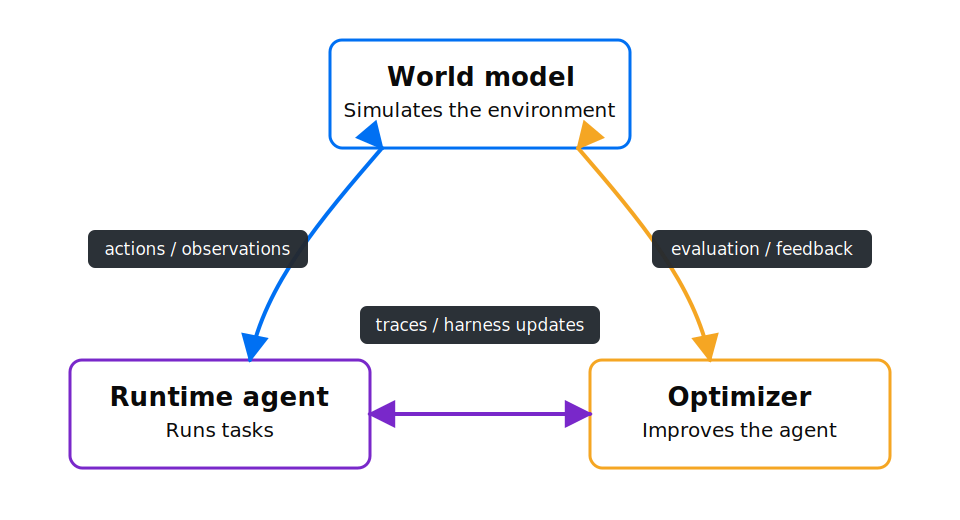

# World Model Harness

`wmh` is an open-source project for running and building continuously improving agents. It
includes a flexible agent runtime, a world model that simulates tool calls, and an optimizer that
builds task-specific harnesses for stronger performance at lower cost.



<p align="center">
  🌐 <a href="https://platform.experientiallabs.ai">Platform</a> |
  📚 <a href="https://github.com/experientiallabs/world-model-harness/tree/main/docs">Docs</a> |
  <a href="https://discord.gg/QwjJpEyHd"> Discord</a>
</p>

## Getting started

### Local setup

Install WMH, choose the model provider for the built-in runtime agent, and start a local run:

```bash
pip install world-model-harness
wmh providers set
wmh run --task "Inspect this repository and explain it"
```

Build a named world model from collected traces:

```bash
wmh build --file traces.jsonl --name my-environment
```

Then optimize an agent harness against that model and a set of tasks:

```bash
wmh optimize my-agent my-environment --tasks tasks.jsonl
```

### Hosted platform

Create an account at [platform.experientiallabs.ai](https://platform.experientiallabs.ai), then
authenticate the CLI:

```bash
wmh login
```

Copy an agent ID from the platform and run its current champion harness:

```bash
wmh run <agent-id>
```

### E2B backend

Hosted agents already run in platform-managed E2B sandboxes. To evaluate a local optimization in
E2B, install the extra and provide an E2B key:

```bash
pip install "world-model-harness[e2b]"
export E2B_API_KEY=...
wmh optimize my-agent my-environment --tasks tasks.jsonl --backend e2b
```

## Use a world model as an API

```python
from wmh import Action, ActionKind
from wmh.config.store import WorldModelStore
from wmh.engine.loader import load_world_model

model_dir = WorldModelStore(".wmh").resolve("airline")
wm, _provider = load_world_model(model_dir)

session = wm.new_session(task="check out the cart")
obs = wm.step(session.id, Action(kind=ActionKind.TOOL_CALL, name="add_to_cart",
                                 arguments={"sku": "A1"}))
print(obs.content)
```

Or over HTTP (same code path), namespaced by model name: `GET /world_models`, then `POST /world_models/{name}/sessions` and `POST /world_models/{name}/sessions/{id}/step`.

## Run after platform login

After `wmh login`, the same `wmh run` command can open a hosted world model or run an agent's
current champion harness in E2B. The platform manages model and sandbox credentials, so hosted
runs do not need local API keys.

```bash
wmh login
wmh run <world-model-or-agent-id>
wmh run <agent-id> -u . --task "fix the failing tests"
```

Workspace upload is opt-in with `-u`: WMH live-syncs changes and preserves concurrent local edits.
Long-running agents can detach, continue in the platform, and be messaged or reattached later.

```bash
wmh run <agent-id> -u . --detach
wmh run --send "Now run the full test suite"
wmh run --attach
wmh run --end
```

## Runtime agents and optimizers in E2B sandboxes

WMH can run the real [pi](https://github.com/earendil-works/pi) worker inside isolated
[E2B](https://e2b.dev) sandboxes while the world model supplies the environment. Optimization and
evaluation rollouts run in parallel, and model credentials stay outside the sandbox.

```bash
wmh optimize my-agent my-environment --tasks tasks.jsonl --backend e2b
wmh eval tasks.jsonl --mode closed-loop --harness my-agent --harness-backend e2b
```

The optimizer can change prompts, tools, policies, skills, and runtime code. Every candidate is
measured against the same simulated tasks, and only changes that pass the evaluation gates become
the new versioned champion harness.

## Development

Managed with [uv](https://docs.astral.sh/uv/); linting/formatting with [ruff](https://docs.astral.sh/ruff/); type checking with [ty](https://github.com/astral-sh/ty). Conventions live in [AGENTS.md](./AGENTS.md).

```bash
uv sync --extra dev      # env + dev tools
uv run ruff check .      # lint
uv run ruff format .     # format
uv run ty check          # type check
uv run pytest -q         # tests
```

## Usage telemetry

`wmh` uses anonymous usage telemetry to track the volume of usage.
Telemetry is strictly metadata. It never includes prompts, traces, actions, observations, file paths,
model names, provider credentials, or raw user content.

Telemetry is enabled by default. To opt out for a project:

```bash
uv run wmh config telemetry disable
```

This writes `.wmh/settings.toml`. You can re-enable it with `uv run wmh config telemetry enable`,
check the current setting with `uv run wmh config telemetry status`, or disable it for a process
with `DO_NOT_TRACK=1` or `WMH_TELEMETRY=0`.
