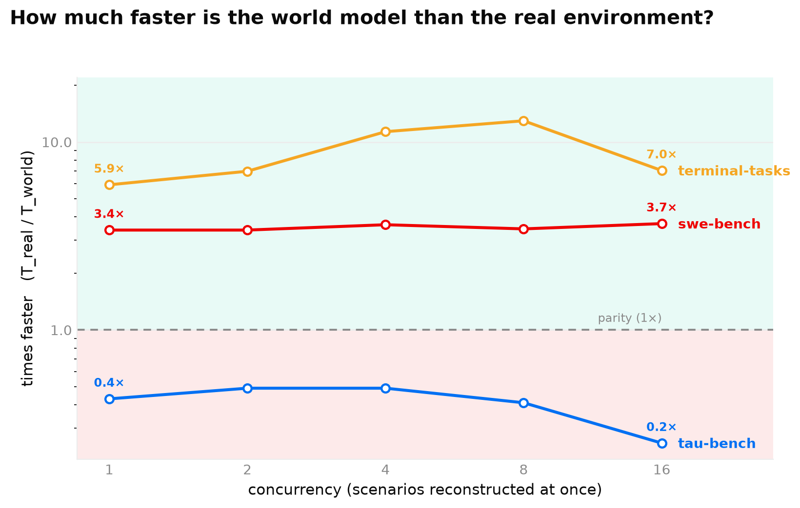
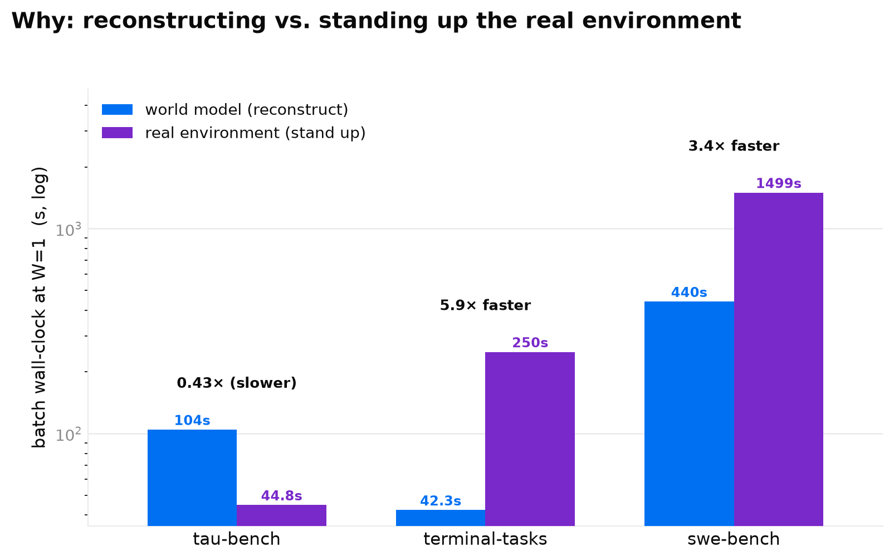

# Concurrency scaling law

**How does the cost of a world model compare to standing up the real environment, and how does that
change as you run more scenarios at once?** For each benchmark we take a fixed set of held-out
scenarios and, at increasing concurrency `W`, time two ways of obtaining the same batch of
observations: the **world model** reconstructs them (open-loop, teacher-forced `predict_observation`),
and the **real sandbox** stands up the actual environment and runs the recorded commands. The metric
is the differential `T_real(W) / T_world(W)` — >1 means the world model is faster.
`wmh/research/concurrency_scaling.py` implements the sweep; run it with
`wmh research concurrency <suite> --side both`.





## The finding: a world model saves time only when real standup is expensive

The organizing principle is a cost comparison, not a concurrency law:

> A world model saves wall-clock **iff the real environment's standup cost exceeds the reconstruction
> cost** (≈ number of steps × per-step model latency).

The world model's cost scales with trace length — it makes one model call per step. The real side's
cost is a (largely fixed) standup plus cheap per-step execution. So the world model wins big where
standup is expensive, and *loses* where it's cheap. Measured on a **representative (`--select
random`) sample**, N=16, GPT-5.4-mini, levels 1,2,4,8,16:

| Benchmark | real standup | world W=1→W=16 | real W=1→W=16 | differential (T_real/T_world) | trials |
|---|---|---|---|---|---|
| **swe-bench** (from-source repo build) | ~minutes | 440s → 141s | 1499s → 518s | **3.4–3.7×** (world faster) | 1 |
| **terminal-tasks** (cold apt container) | ~15s/scenario | 42.3s → 20.6s | 250s → 145s | **5.9–13.0×** (world faster) | 2 |
| **tau-bench** (in-process tau2 DB) | ~none (µs lookups) | 104.5s → 19.1s | 44.8s → 4.7s | **0.25–0.49×** (real faster) | 3 |

- **swe-bench / terminal-tasks — world model wins.** Building the real environment costs minutes
  (swe: repo clone + conda/pip install) or ~15s (terminal: cold `apt` container), which dwarfs the
  world model reconstructing the observations. The right panel of the figure shows it directly: the
  real bar towers over the world bar.
- **tau-bench — the real sandbox wins.** tau2's "standup" is just importing the package and loading
  an in-memory DB; each step is then a ~ms local lookup. The world model instead pays a ~1.5s model
  call *per step*, so with no expensive standup to amortize it is 2–4× **slower** on realistic
  traces. The world model has no wall-clock advantage for a cheap in-process environment.

Concurrency is a **secondary** axis: the differential is set mostly by the standup-vs-reconstruction
ratio above and moves only modestly with `W` (both sides parallelize; the real side saturates the
Docker cap around W=8, the world side is bounded by model-endpoint latency variance).

## Selection sensitivity — why the numbers are drawn `random`, not `simplest`

The scenario draw matters enormously, and getting it wrong is how an earlier version of this result
was inflated. `--select simplest` picks the fewest-step held-out traces; because the world model's
cost scales with steps, that is the single most favorable case for it. Re-running each benchmark on
`simplest` vs a representative `random` draw:

| Benchmark | `simplest` differential | `random` differential | effect of the biased draw |
|---|---|---|---|
| tau-bench | 1.0–1.9× (world faster) | **0.25–0.49× (real faster)** | **flips the sign** |
| swe-bench | 70–138× | **3.4–3.7×** | inflated ~20–40× |
| terminal-tasks | 5.9–11.1× | 5.9–13.0× | ~unchanged (its traces are short anyway) |

So `simplest` overstates the world model everywhere and reverses tau-bench's conclusion. The honest
numbers use `random`. (This is exactly the kind of artifact `--select random|longest` exists to
catch — a result that moves under resampling is an artifact, not a law.)

## Robustness across world models and seeds

The *directions* are not an artifact of one world model or one random draw. Re-running tau-bench and
terminal-tasks with **Claude Haiku 4.5** as the world model, across **3 seeds** each, replicates every
sign: tau-bench stays real-faster (differential ~0.14–0.28 across `W`, all seeds) and terminal-tasks
stays world-faster (~2.7–7.8× mean differential across `W`). Magnitudes track per-call latency — Haiku's
per-step call is not gpt-5.4-mini's — but the crossover (world model wins on expensive-standup envs,
loses on the cheap in-process one) holds across **both world models and all seeds**. The per-seed Haiku
reports and cross-seed aggregates are committed under
[`.agents/docs/research/concurrency_anthropic/`](../../.agents/docs/research/concurrency_anthropic/).

## Machine

Apple **M3 Max**, 16 cores (12P + 4E), **128 GB** RAM, macOS 14.1, with **Docker Desktop capped at
~18.8 GB / 16 CPUs**. That cap is the **binding constraint for swe-bench**'s concurrent multi-GB
from-source builds (and why swe ran at a single trial). The absolute wall-clock numbers only mean
anything against this machine; the *differential* `T_real/T_world` is the portable quantity.

## Method

- **Same scenarios, both sides**, pinned by stable `trace_id` (not list index, whose order differs
  between the two corpus loaders). Drawn with `--select random --select-seed 1`.
- **Fixed N; only concurrency varies.** Every level runs the same N=16 scenarios (not N=W). Each side
  owns a `ThreadPoolExecutor` of width `W`; the world side is safe to parallelize (own provider client
  + metering per scenario, teacher-forced replay, so scenarios are independent).
- **One box, offloaded vs. local.** World-side compute is offloaded to the model endpoint
  (gpt-5.4-mini Responses); the real side's standup is local. Offloaded reconstruction cost
  vs. local standup cost — the real operational question, not a same-silicon race.
- **swe-bench standup** uses `--cache-shared` (auto-forced): the shared base+env images are built once
  and reused, but the per-instance image is cold-built at every level, so a fixed-N sweep measures the
  marginal per-scenario standup (plain `--cache` would cache the instance image after W=1; fully-cold
  would rebuild the 660 MB base 16×/level).

**Caveats.** The world-side timing includes the model endpoint's latency and queueing under load
(appropriate for the operational cost question, not a pure model measurement). swe-bench ran at 1
trial (expensive builds), tau-bench at 3 and terminal-tasks at 2. tau-bench's world side is noisy at
high `W` (±seconds), but its *direction* (real faster) is robust across every level and both draws.

## Reproduce

Each corpus was captured live from its real benchmark (see the capture tooling and READMEs under
`packages/environment-capture/{tau-bench,terminal-tasks,swe-bench}/`). The combined figure above is
the one figure this writeup renders.

**Provenance — read before reproducing.** The headline numbers in the tables above were produced with
**gpt-5.4-mini via the OpenAI Responses API**. That account has since been **deactivated**, so the
exact run is not re-runnable and its raw report JSONs were lost with it. The command below uses the
same model over **Azure OpenAI**, which reproduces the *setup* — but only **tau-bench and
terminal-tasks were re-checked on Azure**, endpoint latency differs, and Docker build jitter affects
the real side, so Azure reproduces the **directions and rough magnitudes, not the exact wall-clock**.
The three headline reports — reconstructed from the published per-benchmark tables above, since the
original OpenAI-Responses JSONs are gone — are committed for provenance under
[`.agents/docs/research/concurrency_anthropic/`](../../.agents/docs/research/concurrency_anthropic/)
(`gpt54_*.json`), next to the Claude Haiku 4.5 re-run.

```bash
export AZURE_OPENAI_API_KEY=... AZURE_OPENAI_ENDPOINT=https://<resource>.openai.azure.com/

# representative sample (--select random); swe-bench auto-forces --cache-shared;
# tau-bench's real side needs its tau2 .venv (TAU2_DATA_DIR); terminal/swe need Docker.
uv run wmh research concurrency tau-bench      --provider azure --model gpt-5.4-mini --deployment gpt-5.4-mini --api-version 2025-04-01-preview \
    --scenarios 16 --levels 1,2,4,8,16 --side both --trials 3 --select random --select-seed 1 \
    --out packages/environment-capture/tau-bench/conc.json
uv run wmh research concurrency terminal-tasks --provider azure --model gpt-5.4-mini --deployment gpt-5.4-mini --api-version 2025-04-01-preview \
    --scenarios 16 --levels 1,2,4,8,16 --side both --trials 2 --select random --select-seed 1 \
    --out packages/environment-capture/terminal-tasks/conc.json
uv run wmh research concurrency swe-bench      --provider azure --model gpt-5.4-mini --deployment gpt-5.4-mini --api-version 2025-04-01-preview \
    --scenarios 16 --levels 1,2,4,8,16 --side both --trials 1 --select random --select-seed 1 \
    --out packages/environment-capture/swe-bench/conc.json

# to reproduce the selection-sensitivity comparison, re-run any suite with --select simplest.
# render the two cross-benchmark figures (needs the `viz` extra: uv sync --extra viz):
uv run wmh research plot-concurrency-combined \
    packages/environment-capture/tau-bench/conc.json packages/environment-capture/terminal-tasks/conc.json packages/environment-capture/swe-bench/conc.json \
    --out-speedup docs/research/concurrency_speedup.png \
    --out-cost docs/research/concurrency_cost.png
```

The per-benchmark report JSONs are git-ignored (regenerate with the commands above); the committed
speed-up and cost figures are the reproducible artifact, and the reconstructed headline reports plus
the Haiku re-run under `.agents/docs/research/concurrency_anthropic/` are the committed provenance.
