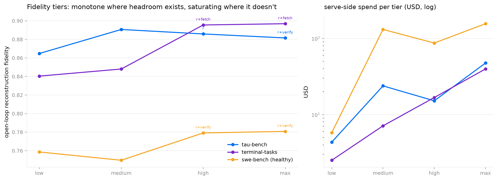

# Fidelity tiers: decisions and learnings

*WS-A3, 2026-07-02 (updated 2026-07-10). How the `--fidelity low|medium|high|max` build
tiers and the runtime `--max-fidelity` switch were designed, what was measured, and the traps
hit on the way. Raw per-suite ladder JSONs live in the workspace layer
(`.agents/docs/research/fidelity_tiers/`, PR #55); the numbers below are complete without
them.*

## The design (D30)

**Build effort is a tier, not an iteration count.** `wmh build --fidelity ...` (flag or wizard
picker) replaces the raw "GEPA rollout budget" question; iteration counts live only in the
Python API:

| tier | prompt | retrieval phi | config search |
|---|---|---|---|
| low | base (no GEPA) | hashing (offline) | — |
| medium | GEPA, 4 iterations | hashing | cheap frontier only (base/reason/grounding), 4 val traces |
| high | GEPA, 4 iterations | hashing | signature-pruned full menu, 4 val traces |
| max | GEPA, 16 iterations | hashing | full ladder, 12 val traces |

**Evidence audit (2026-07-08, user-prompted "each ingredient must improve, not just cost
more"):** two ingredients failed and were removed. (1) Semantic embeddings for high/max: PR
#72's retrieval matrix has ada-002 below lexical hashing on terminal/swe, and a direct
Titan-vs-hashing A/B on tau's full slice (identical steps, seeds 0+1) came back a WASH
(0.942 ±.004 vs 0.939 ±.002) — so the ladder's tau decline at high/max was mis-attributed to
semantic phi (it was GEPA-8/noise). The standing rationale: semantic was never measured BETTER
anywhere, costs provider-embedding calls, and adds a credential step; hashing is free, offline,
and equal-or-better. Hashing at every tier; provider embeddings are explicit opt-in only. (2) High's 8 GEPA iterations: the increment over 4 is ~noise on all three
benchmarks after subtracting the search winners' known lifts (tau −0.005, terminal +0.007, swe
+0.006), consistent with #97's finding that the base template's iteration lift ≈0. High = 4
iterations + the wider search menu. #97 (which precedes this PR in the merge train) supplies the stronger evidence and the fix; re-baseline both calls on top of it: its measurement beats this ladder's
single-seed cells: GEPA lift ≈0 above the RAG plateau on every benchmark at Opus judges
(tau +0.003 / terminal −0.006 / swe +0.002, n=64, seeds 0+1), swe monotonically DEGRADING with
budget (−0.074 at b=16), with two caveats: harsher judges reveal a real terminal gain
(gpt-5.5 +0.039 — Opus leniency saturates it away), and #97's stagnant-or-improve guard +
anti-outcome-flip template are the fix that makes GEPA spend at-worst-neutral. The tiers keep
their user-designed GEPA structure; with #97 merged ahead of this PR, its stagnant-or-improve
guard + template apply to every tier build, making GEPA spend at-worst-neutral. GEPA budgets
remain the tiers' least-evidenced ingredient.
Adopted from #72 for measurement: `max_retrieved_observation_chars` (optimized RAG = hashing +
k=20 + 2000-char cap).

Tier semantics (user-clarified 2026-07-05): the tier rations the EXPENSIVE knobs — whether
GEPA runs, how many iterations, how many candidates/traces the search scores. Price orders the
candidate ladder and breaks score ties; it never shrinks the menu (only signature no-op gates
do) and never picks the winner — fidelity does. Cheap grounding levers (workspace/fetch, ~base
serve cost) are searchable from medium up precisely because they cost almost nothing to try.

**Runtime is binary.** A plain `wmh serve`/`play` is ALWAYS pure RAG — a `knowledge/` dir no
longer auto-activates anything. `--max-fidelity` at runtime turns on the online extras: the
build-measured winner from `auto_fidelity.json` when the artifact has one, otherwise every
extra the artifact supports (reason + verify + KB-if-present + keyless fetch). The config
search never mutates serve defaults; its result is a runtime menu.

**The search is generalized, not per-task.** Candidates map 1:1 onto config flags; which ones
are worth scoring comes from a zero-token `CorpusSignature` (curl-GET share, mean observation
length, tool-call share) whose thresholds were derived from the measured lever matrix — a
tool-call corpus like tau scores only 2 candidates, a web-heavy shell corpus adds fetch, a
content-heavy code corpus adds verify. New corpora get the same machinery, no new prompts or
configs.

## Learnings (each cost real money or a wrong number before it was learned)

1. **GEPA budget units silently changed meaning (runaway cost).** Post-#37, `budget` counts
   optimization ITERATIONS; each iteration costs ~`minibatch + FULL VALSET` metric calls. A
   "budget 50" build on terminal-tasks (137-step valset) is ~7,000 predict+judge pairs — a live
   build hit 970 calls before being killed. Fix: tier budgets sized in iteration units
   (0/4/8/16) plus `TierSpec.gepa_val_cap` (12–16 traces) so per-tier cost is bounded
   regardless of corpus size.
2. **The winning serve config is predictable from corpus shape.** Measured lever matrix:
   reasoning wins on tool-call APIs (tau .899→.919), live fetch wins on web-heavy shells
   (terminal .866→.906 at 40% of the KB's cost), the verify self-check wins on hard content
   prediction (swe .795→.818). No blanket config wins everywhere — hence a per-corpus search
   instead of defaults.
3. **Prune with free signals before spending tokens.** The corpus signature reproduces the
   measured winners without any LLM calls, so the high tier scores 2–4 candidates instead of 5.
4. **Selection and reporting must use different bands.** GEPA selects on (a cap of) VALID; the
   config search selects on VALID; the reported number is the untouched TEST slice. Selecting
   and reporting on the same band flattered GEPA once before (the 3-way-split fix in #37).
5. **Corpus stats used in prompts/thresholds must be computed on HEALTHY data.** A contract
   rule derived from a corpus that was 66% capture junk (D24) measurably hurt on clean data.
6. **Semantic embeddings need memoization at search time.** The config search re-indexes the
   same train steps once per candidate; a per-run embedding cache removes ~80% of Titan calls.

## Tier ladder results (final)

| tier | tau-bench | terminal-tasks | swe-bench (healthy) |
|---|---|---|---|
| low | 0.865 | 0.840 | 0.759 |
| medium | **0.891** | 0.848 | 0.750 |
| high | 0.886 (reason) | 0.895 (reason+fetch) | 0.779 (reason+verify) |
| max | 0.882 (reason+verify) | **0.897** (reason+fetch) | **0.781** (reason+verify) |

Three tier behaviors, all as-designed: terminal is MONOTONE (+0.057 low→max), tau SATURATES at
medium (the unknowable-record ceiling — more spend confirms, doesn't improve), swe steps up when
the search finds verify. The config search independently rediscovered every hand-measured winner
from 4–12 selection traces. Judged on 4.7 (4.8 was quota-contended); the gradient is the result.

**Judge caveat (read before citing absolute numbers):** every number in this report — the lever
matrix, the ladder, and the `CorpusSignature` pruning thresholds derived from them — was
measured under the retired rubric-v1 judge (and the ladder under a single Opus 4.7 judge).
#83's rubric-v2 scores the same predictions ~0.1 lower on average; none of these absolutes are
comparable to rubric-v2 numbers. The FEATURE is unaffected: the config search re-measures
candidates at build time under whatever judge the build runs, so tier selection stays
internally consistent. Only the published constants carry the caveat.

## More learnings (the tail of the session)

7. **A trace-denominated cost cap is not a cost cap.** swe's ~7-huge-step traces turned a
   "4-iteration" GEPA tier into $131 / 1286 serve calls. Steps are the unit that bounds cost.
8. **Same-model retry chains need backoff; different-model chains don't.** And when quota
   contention or a local network flap outlasts any backoff, a CROSS-PROVIDER last resort
   (Anthropic direct — different pool, different network path) is what actually rides it out.
9. **Grounding beat deliberation everywhere it applied** (fetch +0.040 terminal, source +0.020
   swe at half verify's cost) — the critic agent's "fish in the grounding pond" call was right.
10. **The belief-state lever (profile) validated directionally**: neutral where history fits in
   context (tau/terminal), +0.019 where sessions run long (swe). Its real home is closed-loop
   serving, which open-loop eval structurally can't see.
