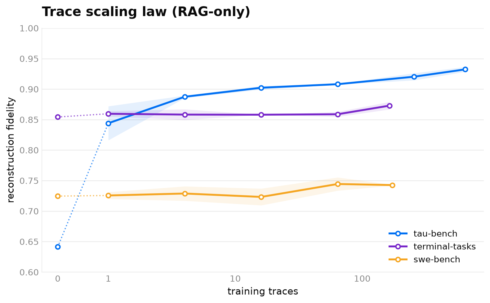
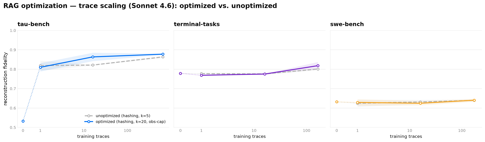
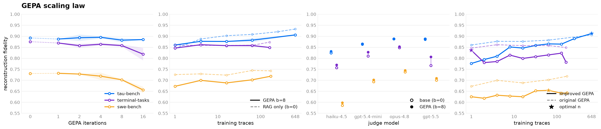
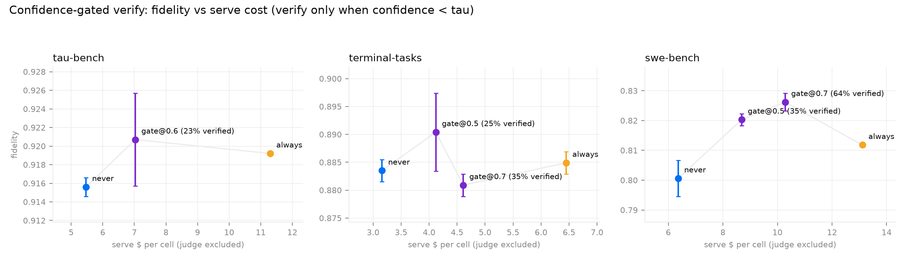

# World-model findings: the layered research record

One question drove this program: **how faithful can an LLM-reconstructed environment get, and
what actually moves that fidelity?** We answered it in layers, each isolating one lever while
holding the rest fixed, each layer's result motivating the next:

| layer | lever under test | study (PR) | one-line result |
|---|---|---|---|
| 1 | training data (trace count) | trace scaling law (#72; v1 in #32/#42) | data helps iff the observation is retrievable from `(state, action)`: tau +0.29, terminal/swe ~+0.02 |
| 2 | retrieval itself | RAG optimization (#72) | `top_k=20` + a 2000-char observation cap; everything fancier is below the noise floor |
| 3 | prompt optimization | GEPA scaling law (#97) | zero lift under the original optimizer; with template v2 + a representative valset, tau +0.022 and swe +0.021 |
| 4 | test-time compute | agentic levers and fidelity tiers (#55) | per-corpus winners (reason / fetch / verify), packaged as `wmh build --fidelity` tiers |
| 5 | self-knowledge | verbalized confidence (#120) | stated confidence is a calibrated P(good step); gating verify and model escalation on it Pareto-wins |
| 6 | economics | concurrency scaling law (#41) | a world model saves wall-clock iff real standup cost exceeds reconstruction cost |

Cross-cutting instruments: the judge overhaul (#83) and the cross-model benchmark grid (#98,
how-to in [`../reference/eval_grid.md`](../reference/eval_grid.md)). The work merged to `main`
as one six-PR train (#41, #72, #97, #55, #120, #98); the six layers map to five study PRs, with
#72 carrying layers 1 and 2 and #98 serving as instrumentation.

## Shared protocol (every layer, stated once)

- **Corpora**: live-captured traces from the real benchmarks (capture tooling and provenance
  under `packages/environment-capture/<suite>/`): tau-bench 1033 traces / 5289 steps,
  terminal-tasks 280 / 685, swe-bench 255 / 1868 (swe scored on the healthy,
  degenerate-dropped corpus where noted).
- **Split discipline**: deterministic by hash of `trace_id` into a fixed test band (the y-axis
  never changes as the corpus grows), a fixed valid band, and a train pool
  (`wmh.research.partition_corpus(test_frac=0.2, valid_frac=0.15)`). Selection (GEPA, config
  search) uses valid; the reported number is always the untouched test slice.
- **Metric**: open-loop reconstruction fidelity. The world model replays recorded steps
  teacher-forced (`predict_observation`); a pinned `RubricJudge` scores each predicted
  observation against the recorded one.
- **Noise floor**: run-to-run serve+judge nondeterminism is ±0.015-0.02 at 2 seeds and the
  standard test caps. Deltas inside that band are flagged as such below.

> **Judge provenance (read before citing any absolute number).** Every number in this record
> was scored by **rubric-v1**, the pre-#83 judge (unweighted mean of five dimensions, no
> validity gating). The #83 overhaul shipped **rubric-v2** (factuality-weighted headline,
> validity flag, `JUDGE_VERSION` stamped into results), which scores the same predictions
> roughly 0.12 lower by design (≈0.58 where v1 read ≈0.70). Re-running any procedure below on
> current `main` scores with rubric-v2 and will not match these tables. The comparisons (which
> lever beats which) are what this record claims; layer 3's judge-sensitivity panel bounds how
> much the instrument can move them.

---

## Layer 1 (data): the trace scaling law (#72; supersedes the #32/#42 version)

**Does feeding the world model more recorded traces improve fidelity?** RAG-only sweeps (the
shipped base prompt plus a retrieval buffer, no GEPA), anchored at `n=0` with retrieval off, so
the n=0 → RAG gap IS the entire contribution of trace data. Serve + judge Opus 4.8.



| Benchmark | n=0 (no-RAG) | n=1 | n=4 | largest | RAG lift (n=0 → max) |
|---|---|---|---|---|---|
| tau-bench (tool calls) | 0.641 | 0.844 | 0.887 | 0.932 (n=648) | **+0.29** |
| terminal-tasks (bash) | 0.854 | 0.860 | 0.858 | 0.873 (n=164) | +0.02 |
| swe-bench (arbitrary code output) | 0.725 | 0.726 | 0.729 | 0.743 (n=173) | +0.02 |

For terminal and swe, zero traces already score 0.854 / 0.725 and the full pool moves them
~0.02: their fidelity is the base model's zero-shot competence, not anything learned from the
corpus. For tau, retrieval is the whole story (+0.20 by the first trace, still climbing at
n=648). Across-seed std ≤0.014 everywhere except tau n=1 (0.028), so both the climb and the
flatness are signal.

**The mechanism.** Retrieval keys on each step's `(state, action)`. In tau the observation is a
deterministic lookup of state the arguments name, the same arguments recur, and a bigger pool
increasingly contains a near-duplicate whose observation is essentially the answer. In
terminal/swe the observation depends on environment state the trace never captures (live web
responses, repo file contents) and is near-unique per step: retrieval finds a lexically similar
command whose output is unrelated, so no number of traces makes it predictive.

**This is reconstruction, not memorization.** Scored zero-shot (no retrieved demos, no
trajectory history, same test split and judge), the model reproduces almost nothing: swe-bench,
the most public benchmark via GitHub, is *lowest* (0.11 factuality, 3% exact match); tau,
synthetic and un-memorizable, is the 0%/0.12 control. Verbatim memorization would show near-1.0
factuality. Adding the recorded trajectory history roughly doubles factuality (swe 0.11→0.40,
terminal 0.27→0.63): the model reconstructs from in-context signal, which is exactly why the
n=0 → RAG gap measures a real contribution rather than recall.

**Takeaway.** More traces of the same kind only buy fidelity when the observation is a
retrievable function of the recorded `(state, action)`. For the rest, the leverage is
elsewhere: richer state capture in the trace format, and the layers below.

## Layer 2 (retrieval): RAG optimization (#72)

**Holding the corpus fixed, can retrieval itself be made more valuable?** Every retrieval
decision ablated: depth, rendering, embedder, key formulation, strategy. Serve + judge Sonnet
4.6 (Opus was capacity-throttled; both arms of every comparison share the model, so deltas are
internally valid while absolute levels sit below layer 1's).



**The robust wins are `top_k` and an observation cap.** The predictive example usually exists
in the pool but sits at ranks 5-50, so `top_k` 5 → 20 surfaces it (k=50 regresses; too many
examples dilute the prompt). And with k=20 over verbose shell output a single prompt's
retrieved-examples block reached **~97k tokens** on terminal-tasks, a real token-limit failure;
capping each retrieved observation at ~2000 chars collapses that ~9× at no measurable fidelity
cost (`max_retrieved_observation_chars`, now a harness seam through render/replay/gepa).

| benchmark | no-RAG (n=0) | unoptimized (k=5) | optimized (k=20 + cap) | Δ |
|---|---|---|---|---|
| tau-bench | 0.533 | 0.863 | **0.878** | +0.015 |
| terminal-tasks | 0.779 | 0.801 | **0.818** | +0.017 |
| swe-bench | 0.632 | 0.639 | 0.640 | +0.001 |

Read the deltas honestly: +0.015/+0.017 sit AT the eval's noise floor, and swe's +0.001 is
zero. The unambiguous results are (a) the crowding fix and (b) the negative results:

| variation | result |
|---|---|
| semantic (ada-002) vs. lexical hashing | semantic **never wins** (e.g. terminal pool 0.790 vs. 0.818) |
| key: command-only / raw | small offline gain; washes out live, hurts tau (0.865 vs 0.878) and swe (0.615 vs 0.640) |
| key: mask URLs/paths/numbers | hurts; over-masks the discriminative tokens |
| key: task + command | helps terminal offline, hurts swe; net wash |
| HyDE (retrieve on a hypothetical output) | identical to command retrieval |

These observations are predicted by literal token overlap (URLs, paths, flags, test names),
which char-trigram hashing captures exactly and semantic embeddings blur. More fundamentally,
on a fair semantic obs-match metric, action-based retrieval already lands at ~0.87-0.90
(terminal) / ~0.76-0.80 (swe) against oracles of 0.92 / 0.79: **retrieval is already near its
ceiling.** The residual gap is not a retrieval problem; the outputs are unpredictable from any
demo.

**Takeaway.** Optimized RAG = lexical hashing + `top_k=20` + a 2000-char cap. Retrieval is not
what unlocks the hard benchmarks; the leverage moved to layers 3-5.

## Layer 3 (optimization): the GEPA scaling law (#97)

**Does prompt optimization move what retrieval could not?** Fidelity vs GEPA iterations
(`budget`) and vs the trace count GEPA learns from, against the same fixed test set. Serve and
optimize on Opus 4.7 (4.8 throttles under GEPA's call volume; own b=0 anchors sit ~0.01-0.02
under layer 1's), judge Opus 4.8. `budget=0` reproduces layer 1's RAG-only point, a built-in
consistency anchor between the experiments.



**Finding 3.1: under the original optimizer, GEPA does not lift fidelity above the RAG
plateau.** Budget sweep at n=64 (seeds 0-1):

| b | tau-bench | terminal-tasks | swe-bench |
|---|---|---|---|
| **0 (GEPA off)** | 0.892 ±0.004 | 0.875 ±0.010 | 0.730 ±0.003 |
| 4 | 0.895 ±0.005 | 0.863 ±0.006 | 0.718 ±0.017 |
| 8 | 0.882 ±0.010 | 0.857 ±0.006 | 0.702 ±0.003 |
| 16 | 0.885 ±0.002 | 0.819 ±0.028 | 0.656 ±0.015 |
| **lift (0 → best b)** | **+0.003** | **−0.006** | **+0.002** |

Terminal and swe actively degrade with budget (swe monotonically, 0.730 → 0.656 at b=16). And
no trace count rescues it: the dense n-sweep at b=8 found tau's optimum at the full pool (0.912,
still below its 0.932 RAG ceiling; retrieval doing the work), terminal's argmax at n=1 (where
GEPA has nothing to learn and leaves the prompt alone), swe's shallow optimum at n≈64 far below
its 0.730 base. Low n is actively dangerous: prompts distilled from 2-4 traces maximize
overgeneralized priors (terminal drops to 0.780).

**Finding 3.2: GEPA learns real knowledge; the residual errors are unknowable values.** The
evolved prompts encode correct, environment-specific rules (mutation tools return bare
"Transfer successful" strings; unknown ids yield structured not-found errors; per-tool field
projections). The knowledge is right; it doesn't move the metric because the residual test
errors are unknowable-value errors: the exact `data_used_gb` of a fresh lookup, a live API's
result count, actual repo file contents. Per-step diffs found the two harm mechanisms:
overgeneralized outcome priors ("GitHub calls often rate-limit" flips real successes into
predicted errors; net ≈ 0 redistributed fidelity) and unknowable-value advice bleeding into
derivable outputs (a word count fully computable from the command's own heredoc regressed
1.00 → 0.62). Concentrating reflection on failures makes it worse, not better (hard-step arm:
0.845/0.804/0.643 vs plain b=8's 0.872/0.852/0.705).

**Finding 3.3: why a "won" search can end below its own anchor, and the fix.** Re-scoring the
same base prompt on the same 30-step valset three times gave 0.744/0.774/0.796 (std ≈0.02):
promotion is argmax over single-sample evaluations inside that noise band, which systematically
selects noise-inflated candidates (the winner's curse). Two optimizer changes landed in
`wmh/optimize/gepa.py` from this diagnosis: a **stagnant-or-improve acceptance re-check** (a
non-base winner must replicate its win on a fresh paired evaluation or base is restored,
`OptimizeMetrics.reverted_to_base`; guard v2 re-checks on a valset-disjoint slice via
`recheck`) and the **anti-outcome-flip reflection template** (no frequency-based outcome flips;
classify values as derivable / session-established / external-unknowable). Three independent
replicates of the worst cell (no guard 0.790, v1 0.769, v2 0.788) confirmed the guard blocks
noise-promotion; the residual is selection-data bias (step-capped valsets over-represent
short traces).

**Finding 3.4: the conclusion is judge-robust; absolute fidelity is not.** The same predictions
re-scored by four judges: no judge sees a tau lift Opus missed (|Δ| ≤0.007); absolute levels
move by up to ~0.15 across judges (swe: Haiku 0.586 vs Opus 0.737), so fidelity is only
comparable with the judge pinned. Terminal is the sharpening exception: every judge sees a
positive b0→b8 delta and the harsher the judge the bigger (gpt-5.5 +0.039 vs Opus +0.006);
Opus generosity partially saturates away a small real improvement.

**Finding 3.5: with the right reflection prompt and data configuration, GEPA finally lifts.**
Rereading the GEPA paper (arXiv 2507.19457) against the integration exposed two departures:
reflection minibatches of 3 (paper: ~8) and a 30-step short-trace-biased selection valset. With
both exposed as knobs and template v2 as default, the 2×2 grid at b=8/n=64:

| config | tau (anchor 0.892) | terminal (0.875) | swe (0.730) |
|---|---|---|---|
| mb=3, val=30 greedy | 0.900 | 0.844 | 0.749 |
| mb=8, val=30 greedy | 0.900 | 0.864 | 0.750 |
| mb=3, val=90 inclusive | **0.914** | 0.858 | **0.751** |
| mb=8, val=90 inclusive | **0.914** | 0.856 | 0.737 |

Template v2 is the biggest single factor (+0.02 to +0.05 over the old template at the identical
configuration; it turns swe from GEPA's worst case into its clearest win). Selection-set
representativeness buys tau +0.014, reaching **0.914, +0.022 over anchor, the first
configuration in the program where GEPA beats base+RAG**. Terminal never lifts under any
configuration (its failure mass is unknowable content); the improved optimizer only removes the
harm.

**Operational answer.** Template v2 + a ≥90-step inclusive selection valset + the full trace
pool + b≈8, minibatch 8. Worth running where failures include fixable convention/evidence
errors (tau +0.022, swe +0.021), safely neutral elsewhere. Never on a handful of traces.

## Layer 4 (test-time compute): agentic levers and fidelity tiers (#55)

**If build-time optimization is capped by unknowable state, can serve-time compute buy it
back?** #55 gave the world model test-time levers: a reasoning pass, an editable knowledge base
seeded from train traces, keyless web grounding (fetch/registry/repo-tree/workspace channels),
and a verify self-check second completion.


The measured lever matrix (rubric-v1, Opus serve):

- **reasoning** wins on tool-call APIs: tau .899 → .919;
- **live fetch** wins on web-heavy shells: terminal .866 → .906 at ~40% of the KB's cost;
- **verify** wins on hard content prediction: swe .795 → .818 (at ~2× cost);
- **workspace** (ground-truth repo content injection) is swe's biggest single lift and the
  channel layer 5 shows also repairs confidence.

No blanket config wins everywhere, hence a per-corpus search instead of defaults. The product
packaging is `wmh build --fidelity low|medium|high|max` + runtime `--max-fidelity`:

| tier | prompt | retrieval phi | config search |
|---|---|---|---|
| low | base (no GEPA) | hashing (offline) | none — ships the signature estimate (the floor) |
| medium | GEPA, 4 iterations | hashing | cheap frontier, 4 val traces, floored at the estimate |
| high | GEPA, 4 iterations | hashing | signature-pruned full menu, 8 val traces, floored at the estimate |
| max | GEPA, 16 iterations | hashing | full ladder, 16 val traces, floored at the estimate |

`low` is not plain RAG: `signature_estimate` reads the zero-token `CorpusSignature` and returns
the matrix's estimated-best config for the corpus shape (tool-call → reason, curl-heavy →
reason+fetch, content-heavy bash → reason+kb, else reason) with no LLM calls. Every searching
tier seeds that same deterministic estimate as an **incumbent floor** and only replaces it when
a challenger clears the selection-noise band (`_NOISE_MARGIN`, 0.01). The guarantee this buys is
**"no searching tier ships worse than the low estimate"** — precisely `tier ≥ low`, *not*
`high ≥ medium` (medium and high search different menus on different sample sizes, so adjacent
tiers are not strictly ordered; strict rung-over-rung monotonicity would need each tier's
incumbent seeded from the previous tier's winner, which the ladder does not do). The chosen
config serves under `--max-fidelity`; a plain `wmh serve` stays pure RAG.

An evidence audit removed two ingredients that failed "each ingredient must improve, not just
cost more": semantic embeddings at high/max (layer 2's negative result, confirmed by a
Titan-vs-hashing A/B on tau's full slice: 0.942 ±.004 vs 0.939 ±.002, a wash) and high's 8 GEPA
iterations (increment over 4 ≈ noise on all three benchmarks, consistent with layer 3). The
ladder (judged on a single Opus 4.7 judge; the gradient, not the absolutes, is the result):

| tier | tau-bench | terminal-tasks | swe-bench (healthy) |
|---|---|---|---|
| low | 0.865 | 0.840 | 0.759 |
| medium | **0.891** | 0.848 | 0.750 |
| high | 0.886 (reason) | 0.895 (reason+fetch) | 0.779 (reason+verify) |
| max | 0.882 (reason+verify) | **0.897** (reason+fetch) | **0.781** (reason+verify) |

These absolutes predate the incumbent floor and are why it was added: the ladder ran an
independent search per tier, so tau's **high 0.886 < medium 0.891** was a config crowned on
selection noise that lost on the test slice. Under the floor every searching tier is anchored to
the low estimate instead, so a tier can no longer ship below it (the residual high-vs-medium
wobble is expected, not a regression — see the guarantee above). The config search rediscovered
every hand-measured winner from a few selection traces, pruned by a zero-token `CorpusSignature`
(curl-GET share, mean observation length, tool-call share).

Applying this to the shipped example models (rebuilt at `high`, each replaced only when it beat
the deployed model on a held-out slice with a pinned judge): 8 of 9 improved (+0.014 to +0.105,
mostly reason+kb/reason winners); tau-bench regressed under `high` (0.869 → 0.828, its shipped
model had heavier GEPA than `high` reproduces) and was kept — the only-replace-if-better gate
working as intended.

Hard-won learnings that shaped the harness: GEPA budgets must be iteration-denominated with a
step-capped valset (a "budget 50" build once hit ~7,000 predict+judge pairs; a
trace-denominated cap turned a "4-iteration" swe tier into $131); selection and reporting must
use different bands; corpus stats used in prompts must be computed on healthy data (a rule
derived from a 66%-junk corpus measurably hurt on clean data).

## Layer 5 (self-knowledge): verbalized confidence (#120)

**Does the world model know which steps it can't know?** An opt-in `confidence` field in the
output contract (0.0-1.0, decoded after `output`/`is_error` so it conditions on the answer
given). The judge never sees the stated confidence and GEPA cannot optimize with the field on
(both regression-tested; a gameable confidence would invalidate everything below). Serve Opus
4.7, judge pinned Opus 4.8, "good step" = judge ≥ 0.8.

**Finding 5.1: the confidence is real.** Stated on ~100% of steps, fidelity-neutral to
mildly positive (+0.013 tau), with strong discrimination everywhere (AUROC .84-.98, monotone
reliability curves). Its lowest values land precisely on the irreducible-uncertainty
populations (live-web curl bodies, unknowable held-out records, unseen repo content), and
ground-truth injection raises confidence exactly there (swe reason .53 → workspace .64, with
AUROC improving to .881): the confidence tracks the evidence it was given. A one-line
justification variant (`+confwhy`) improves ECE on every suite for ~2k extra output tokens per
100 steps.

**Finding 5.2: the number is a calibrated P(good step).** Tested against different targets, the
stated confidence matches P(judge ≥ 0.8) within ≤.06 aggregate gap on every suite (the apparent
"underconfidence" against mean judge score is an artifact of comparing a probability to a
partial-credit average). Against exact match it is overconfident by a corpus-dependent margin
(+.12 to +.41), fixable with a ~500-step isotonic remap that transfers across seeds (ECE(exact)
terminal .27 → .04, swe .40 → .07). One real miscalibrated pocket: program execution on
terminal (+.21 overconfident), the natural target for execution-grounding channels.

**Finding 5.3: selective fidelity.** Answer only when confidence ≥ τ and fidelity of covered
steps rises monotonically on every suite: tau .916 → **.988 at 70% coverage**; terminal .883 →
.96 at ~55%; swe .80 → .875 at ~70%. A serving world model can flag the steps an RL trainer or
eval gate should distrust, at zero extra completions.

**Finding 5.4: confidence-gated verify Pareto-beats always-verify.**

| suite | never | gated | always |
|---|---|---|---|
| tau (τ=0.6) | .916, $5.5 | **.921, $7.0** (23% verified) | .920, $11.3 |
| terminal (τ=0.5) | .883, $3.2 | **.890, $4.1** (25% verified) | .885, $6.5 |
| swe (τ=0.5) | .801, $6.4 | **.820, $8.7** (35% verified) | .812, $13.1 |
| swe (τ=0.7) | - | **.826, $10.3** (64% verified) | - |



The headline is swe: gated@0.7 reaches .826, above always-verify's .812, at 79% of its cost.
Gating doesn't just skip cost; it removes the harm blanket verify does to confident drafts (a
revision pass on an already-right answer sometimes un-fixes it). Verify is only valuable where
the model already said it was unsure, and it knows where that is.

**Finding 5.5: calibration is intrinsic to model strength, not learned from traces.** Sweeping
n_train leaves AUROC flat (you cannot buy calibration with more data). Across serving models,
strong models are calibrated-to-underconfident everywhere; Haiku 4.5 holds calibration while
the task is within reach (tau, where it matches Opus fidelity at ~8× lower cost) and collapses
into classic overconfidence on swe (+.22, AUROC .61). Self-knowledge degrades before, and
faster than, fidelity does.

**Finding 5.6: confidence-gated model escalation.** Draft on Haiku, re-predict on Opus only
below τ: where the cheap model's calibration holds (terminal), gate@0.9 recovers ~76% of the
Haiku→Opus fidelity gap at half of Opus-direct's cost, escalating 29% of steps. Where
calibration is broken (swe) the gate still lifts +.14 but leaves a .046 residual: the price of
miscalibration, measured. Deployment rule of thumb: check the cheap model's AUROC; ≥.8 the gate
pays, ≤.6 pay for the strong model.

## Layer 6 (economics): the concurrency scaling law (#41)

**When does simulating the environment beat standing up the real one?** For fixed held-out
scenarios at concurrency W ∈ {1,2,4,8,16}, time the world model reconstructing the batch
(teacher-forced, one model call per step) against the real sandbox standing up and executing it
(same scenarios both sides, pinned by `trace_id`, N=16, gpt-5.4-mini, `--select random`).
Timing-only: no judge, so no rubric caveat applies.


> A world model saves wall-clock **iff the real environment's standup cost exceeds the
> reconstruction cost** (≈ steps × per-step model latency).

| Benchmark | real standup | differential (T_real/T_world) | trials |
|---|---|---|---|
| swe-bench (from-source repo build) | ~minutes | **3.4-3.7×** (world faster) | 1 |
| terminal-tasks (cold apt container) | ~15s/scenario | **5.9-13.0×** (world faster) | 2 |
| tau-bench (in-process tau2 DB) | ~none (µs lookups) | **0.25-0.49×** (real faster) | 3 |

Concurrency is a secondary axis; the differential is set by the standup-vs-reconstruction ratio
and moves only modestly with W. Two robustness results matter as much as the headline:

- **Selection sensitivity.** `--select simplest` (fewest-step traces, the world model's most
  favorable case) inflated swe ~20-40× and *flipped tau's sign*. The honest numbers use
  `random`; a result that moves under resampling is an artifact, not a law. The CLI default is
  `random` for exactly this reason.
- **Replication.** Re-running tau and terminal with Haiku 4.5 as the world model across 3 seeds
  replicates every sign; magnitudes track per-call latency, the crossover holds across both
  world models and all seeds.

Provenance: the headline ran on the OpenAI Responses API (account since deactivated; only
tau/terminal were re-checked on Azure, which reproduces directions and rough magnitudes, not
exact wall-clock). Machine: Apple M3 Max, 12P+4E cores, 128 GB, Docker capped at ~18.8 GB / 16
CPUs (the binding constraint for swe's concurrent builds). The differential, not the absolute
wall-clock, is the portable quantity.

## Cross-model generality: the benchmark grid (#98)

The layers above pin one serving model per study. `wmh eval grid` (reference:
[`../reference/eval_grid.md`](../reference/eval_grid.md)) re-asks the base/+RAG/+GEPA/+GEPA+RAG
question across five serving models × four benchmarks under one pinned judge, with
`JUDGE_VERSION` stamped into every result and merges refusing mixed-version or mixed-split
reports. The archived reference run is rubric-v1 and reference-only; re-run before comparing
against anything current.

## The through-line

Each layer moved the binding constraint one step further out, and they converge on one
sentence: **past a low floor, world-model fidelity is bounded by information the trace never
captured, and every lever that works either surfaces that information or prices its absence.**

- Data (layer 1) only helps where the observation is a retrievable function of what was
  recorded.
- Retrieval tuning (layer 2) is worth one noise-floor delta and a real crowding fix; it is
  near its oracle ceiling.
- Prompt optimization (layer 3) distills true knowledge but cannot manufacture unknowable
  values; fixed, it is at-worst-neutral and lifts where failures are convention errors.
- Test-time grounding (layer 4) is the first lever that injects genuinely new information at
  serve time (fetch, workspace), and it wins exactly where layers 1-3 could not.
- Confidence (layer 5) prices the residual: the model states a calibrated P(good) that locates
  the unknowable steps, making abstention, gated verification, and gated escalation cheap.
- The economics (layer 6) say when any of this is worth running at all: the world model's
  advantage is the real environment's standup bill, nothing else.

And one meta-lesson cost more than any compute: **the metric is an instrument.** The judge
re-based the scale mid-program (#83), judges disagree by up to 0.15 absolute on identical
predictions, and an unpinned judge or a biased scenario draw (`--select simplest`) can flip a
conclusion's sign. Every number in this record is pinned to its judge, split, seeds, and
machine; treat any number without that pinning as unfalsifiable.

## Reproduce

All six layers are driven by the public `wmh` API; any thin driver reproduces them. Corpora:
`packages/environment-capture/<suite>/traces.otel.jsonl` via `wmh.ingest` (adapter
`otel-genai`, degenerate traces dropped for swe-healthy). Splits via
`wmh.research.partition_corpus(test_frac=0.2, valid_frac=0.15)`. Figures: matplotlib over the
result JSONs, brand palette per AGENTS.md rule 15.

```text
Layer 1  wmh.research.TraceScalingAblation + run_ablation
         counts=1,4,16,64,256,648 (auto-caps at each pool), modes=base, seeds=0,1,
         sample_turns=sampled, test_cap=40, concurrency=8, top_k=5
         serve + judge us.anthropic.claude-opus-4-8 (Bedrock, AWS_PROFILE=default us-east-1),
         HashingEmbedder(dim=512); n=0 anchor = same scoring with retrieval disabled
         contamination probe = predict_observation with no demos and no history, same split

Layer 2  same ablation, counts=1,16,<pool>, test_cap=15,
         serve + judge us.anthropic.claude-sonnet-4-6 (us-west-2)
         optimized arm: top_k=20, max_retrieved_observation_chars=2000,
         retrieval_key="state_action"; unoptimized: top_k=5, no cap
         semantic arm: Azure ada-002 embedder; command-only key arm: retrieval_key="action"

Layer 3  wmh.research.GepaScalingAblation + run_ablation
         common: sample_turns=sampled, test_cap=40, concurrency=8, gepa_val_steps=30
         budget axis: budgets {0,1,2,4,8,16} at counts=64, seeds 0,1
         trace axis: counts {1,4,16,pool} at budgets=8, seed 0
         dense sweep: counts {1,2,4,8,16,32,64,128,256,pool} at budgets=8, seed 0
         winning config: minibatch_size=8, gepa_val_steps=90, val_fill=inclusive,
         recheck_steps=30; hard arm: hard_threshold=0.9
         judge arm: same predictions re-scored per judge (GPT judges need OPENAI_API_KEY)
         serve/optimize us.anthropic.claude-opus-4-7, judge us.anthropic.claude-opus-4-8,
         capacity-only failover ladder

Layer 4  wmh build --fidelity low|medium|high|max (the tier ladder is the build product);
         lever matrix via the layer-1 ablation's mode registry (reason, +kb, +fetch, +verify,
         +source, +workspace, +poll); runtime winners recorded in auto_fidelity.json

Layer 5  layer-1 ablation with composable modes base+conf, reason+conf, reason+confwhy,
         reason+gateverify@τ, escalate_below for the Haiku→Opus ladder;
         results_dir=<dir> persists per-cell ReplayReports (the per-step
         (confidence, judge-score) joins the calibration analysis needs);
         counts: tau 200 / terminal 160 / swe 24, seeds 0,1, test caps 40/40/20

Layer 6  wmh research concurrency <suite> --side both --scenarios 16 --levels 1,2,4,8,16
         --select random --select-seed 1 (trials: tau 3 / terminal 2 / swe 1; swe auto-forces
         --cache-shared); figures via wmh research plot-concurrency-combined
```
