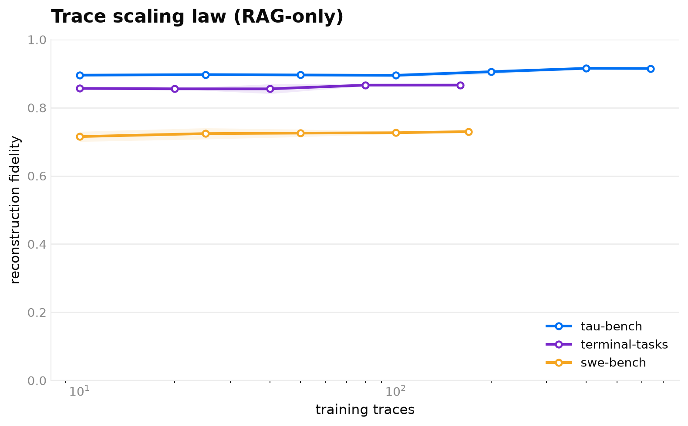

# Trace scaling law

**Does feeding the world model more recorded traces improve how faithfully it reconstructs the
environment?** We sweep the number of *training* traces against a fixed held-out test set and measure
open-loop reconstruction fidelity (RAG-only — the shipped base prompt with a retrieval buffer over
the training traces, no GEPA). One curve per benchmark.

The corpus is split deterministically (hash of `trace_id`) into a fixed `test` band (the y-axis,
never changes as the corpus grows), a fixed `valid` band, and a train *pool*; each sweep point draws
`n` traces from the pool (nested per seed), so the only thing varying along x is how much training
data the model sees. `wmh/research/trace_scaling.py` implements the ablation.



## The finding: fidelity saturates almost immediately

All three curves are **flat**. Going from 10 → hundreds of training traces barely moves fidelity:

| Benchmark | fidelity @ smallest | fidelity @ largest | corpus (traces / steps) |
|---|---|---|---|
| tau-bench (tool calls) | ~0.90 (n=10) | ~0.92 (n=640) | 1033 / 5289 |
| terminal-tasks (bash) | ~0.86 (n=10) | ~0.87 (n=160) | 280 / 685 |
| swe-bench (arbitrary code output) | ~0.72 (n=10) | ~0.73 (n=170) | 255 / 1868 |

The across-seed std at every point is small (≤0.016), so the flatness is real, not noise. A handful
of retrieved neighbours is enough for the frontier model to reconstruct the next observation; more
of the same trace distribution adds little.

The **level** each curve saturates at tracks task difficulty, exactly as expected: tau-bench's
tool-call results are the most reconstructable, terminal shell output next, and swe-bench's arbitrary
code-execution output (tracebacks, pytest logs) is the hardest — the low-fidelity end by design.

**Takeaway:** the leverage is in *prompt/optimization and observation difficulty*, not raw trace
count. Past a small buffer, collecting more traces of the same kind is not where fidelity comes from.

## Reproduce

The curves come from `scripts/run_trace_scaling.py` (RAG-only, `--modes base`), scored with the
canonical `RubricJudge` on a fixed test split, parallelized (`--concurrency`) and cost-bounded
(`--test-cap`). Raw `AblationReport` JSONs are under [`trace_scaling_results/`](./trace_scaling_results).

```bash
# one benchmark's curve (per-benchmark; adjust --counts to the corpus)
AWS_REGION=us-east-1 uv run python scripts/run_trace_scaling.py terminal-tasks \
  --counts 10,20,40,80,160 --modes base --seeds 0,1 \
  --sample-turns sampled --test-cap 40 --concurrency 8 --out term.json

# render all three into the figure (matplotlib is ephemeral, not a project dep)
uv run --with matplotlib python scripts/plot_trace_scaling.py \
  --report tau-bench=tau.json --report terminal-tasks=term.json --report swe-bench=swe.json \
  --out docs/trace_scaling_law --title "Trace scaling law (RAG-only)"
```

Each corpus was captured live from its real benchmark; see the capture tooling and READMEs under
`examples/tau-bench/`, `examples/terminal-tasks/`, and `examples/swe-bench/`.
